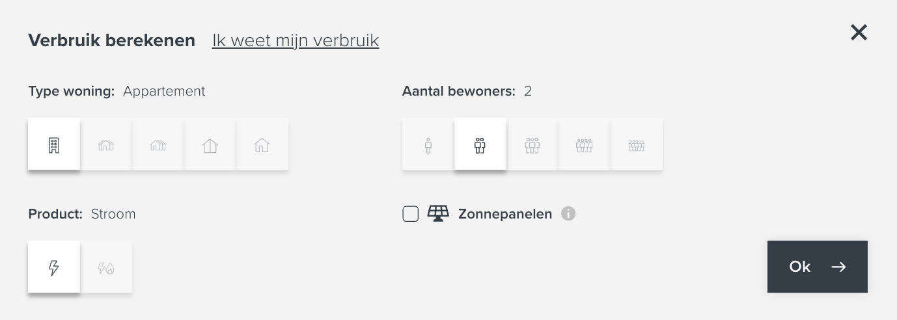

## Vandebron Frontend Developer Take-home Assessment
Thanks for applying to Vandebron!! If you've made it this far we already think you're pretty great. Your assignment is below.

## Setup
- Clone the repo and decide on a framework you'd like to complete the project in (currently only React)
- Start the project by following the "Getting Started" instructions in the example project. Compare what your app looks like now with the desired app shown below.

<table>
  <thead>
    <tr>
      <th>Example Starter App</th>
      <th>Goal App</th>
    </tr>
  </thead>
  <tr>
    <td></td>
    <td></td>
  </tr>
</table>

There are several areas you can focus on. Pick what you'd like to focus on and implement those. Please don't take more than 4 hours on this.

## Todo
- [ ] Update styling of the app to make it look like the goal app above. Note that you do not need to spend any time implementing components/features that aren't visible in the goal app.
- [ ] There are a few bugs in the app - feel free to fix any that you find
- [ ] Calculate the estimated usage based on the inputs provided - there are no strict rules here but generally the "bigger" the house, the higher your consumption, same for amount of people, etc. Should return a type of `{ electricity: number, gas?: number }`
- [ ] For several reasons, the app isn't production-ready. Make changes so that we can be confident the app will run without issue once we're ready to release.

## All Done?
Once you're done, zip up your solution and send it back to us via your favorite file share: Google Drive, Dropbox, etc. During your in-person interview, we'll review your PR so be ready to discuss the changes you've made. Happy coding 😃!!