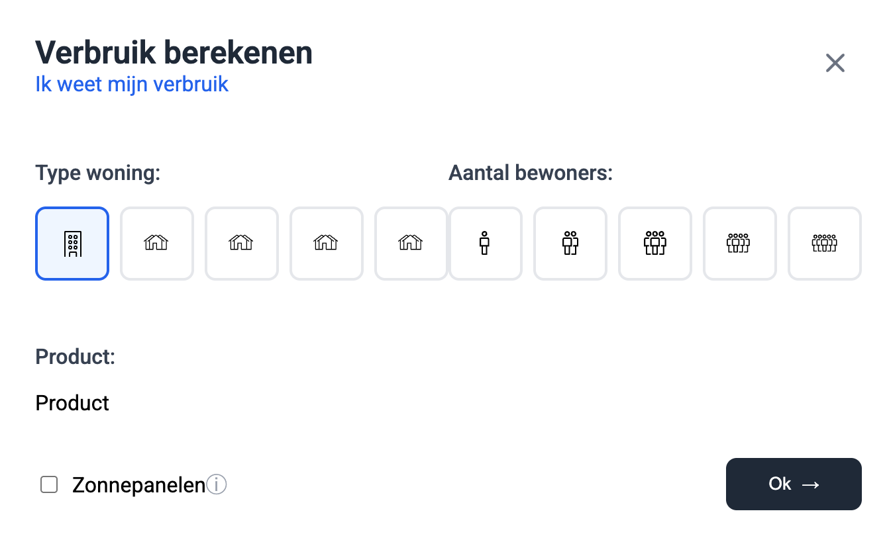

# React Example

## Getting Started
From this project directory, do the following

### Prerequisites
1. Run `yarn install`

### Test
1. Run `yarn test`

### Develop
1. Run `yarn dev`
2. Confirm you see an application that looks like this
